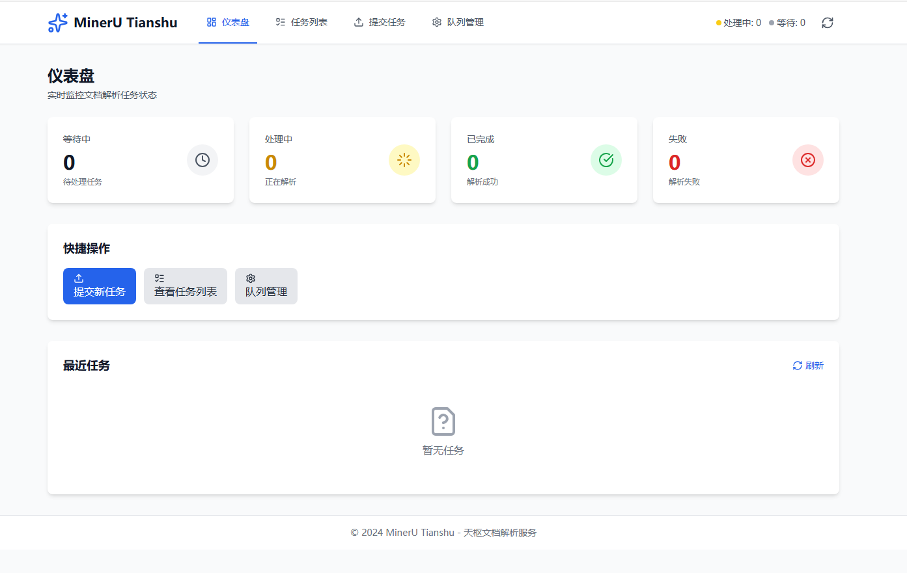
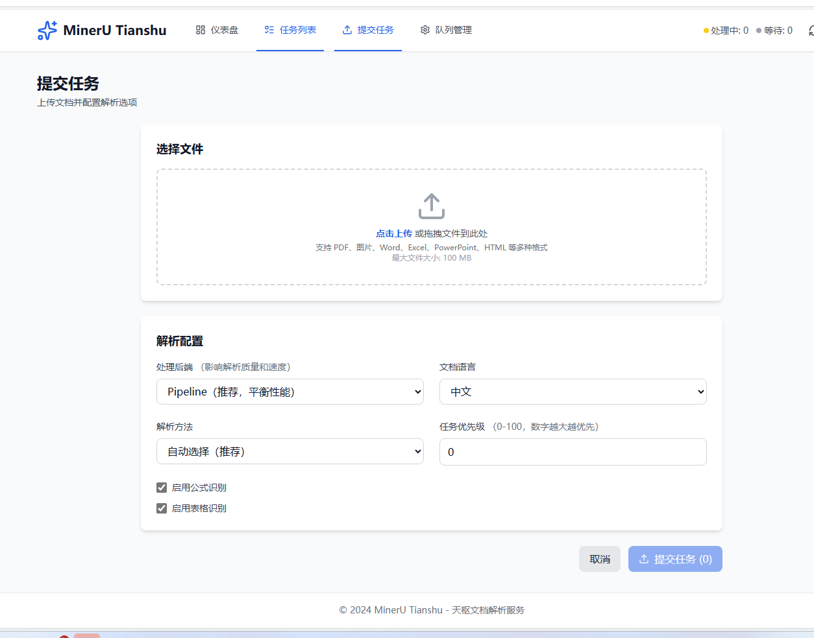
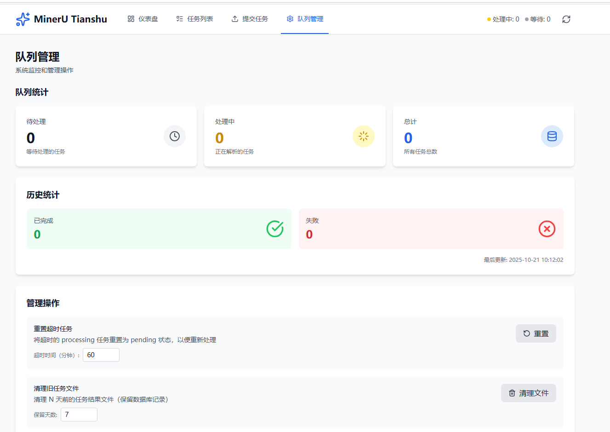

<div align="center">

# MinerU Tianshu 天枢

**Enterprise-grade AI Data Preprocessing Platform**

Multi-modal Data Processing (Documents, Images, Audio) | GPU Acceleration | MCP Protocol

Vue 3 Frontend + FastAPI Backend + LitServe GPU Load Balancing

<p>
  <a href="https://github.com/magicyuan876/mineru-tianshu/stargazers">
    
  </a>
  <a href="https://github.com/magicyuan876/mineru-tianshu/network/members">
    
  </a>
  <a href="https://github.com/magicyuan876/mineru-tianshu/blob/main/LICENSE">
    
  </a>
</p>

<p>
  
  
  
  
  
</p>

English | [简体中文](./README.md)

<p>
  <a href="https://github.com/magicyuan876/mineru-tianshu">
    
  </a>
</p>

**If you find this project helpful, please ⭐ Star it! Your support means a lot!**

</div>

---

## 📝 Latest Updates

### 2025-10-30 🐳 Docker Deployment + Enterprise Authentication

- ✅ **Docker Containerization Support**
  - **One-Click Deployment**: Complete full-stack deployment with `make setup` or deployment scripts
  - **Multi-Stage Build**: Optimized image size, separated dependency and application layers
  - **GPU Support**: NVIDIA CUDA 12.6 + Container Toolkit integration
  - **Service Orchestration**: Complete orchestration of frontend, backend, Worker, MCP (docker-compose)
  - **Developer Friendly**: Hot reload, remote debugging (debugpy), real-time logs
  - **Production Ready**: Health checks, data persistence, zero-downtime deployment, resource limits
  - **Cross-Platform Scripts**:
    - Linux/Mac: `scripts/docker-setup.sh` or `Makefile`
    - Windows: `scripts/docker-setup.bat`
  - **Complete Documentation**: `scripts/DOCKER_QUICK_START.txt`, `scripts/docker-commands.sh`
  - See: Docker configuration files (`docker-compose.yml`, `backend/Dockerfile`, `frontend/Dockerfile`)

- ✅ **Enterprise-Grade User Authentication & Authorization**
  - **JWT Authentication**: Secure token-based authentication with Access Token and Refresh Token
  - **User Data Isolation**: Each user can only access and manage their own task data
  - **Role-Based Access**: Administrator (admin) and regular user (user) roles
  - **API Key Management**: Users can self-generate and manage API keys for third-party integration
  - **User Management**: Admins can manage all users, reset passwords, enable/disable accounts
  - **SSO Ready**: Support for OIDC and SAML 2.0 single sign-on (optional configuration)
  - **Frontend Integration**: Login/registration pages, user profile, permission route guards
  - **Database Migration**: Automatic default user creation for existing data
  - See: `backend/auth/` directory

### 2025-10-29 🧬 Bioinformatics Format Support

- ✅ **New Plugin-Based Format Engine System**
  - Support for parsing and structuring professional domain document formats
  - Unified engine interface, easy to extend new formats
  - Provide both Markdown and JSON format output for RAG applications

- ✅ **Bioinformatics Format Engines**
  - **FASTA Format**: DNA/RNA/Protein sequence parsing
    - Sequence statistics (count, length, average)
    - Base composition analysis (A/T/G/C ratios)
    - Automatic sequence type detection (DNA/RNA/Protein)
  - **GenBank Format**: NCBI gene sequence annotation format
    - Complete annotation information extraction
    - Feature type statistics (gene/CDS/mRNA, etc.)
    - GC content calculation and organism information
  - Support BioPython or built-in parser (optional dependency)
  - See: `backend/format_engines/README.md`

### 2025-10-27 🎨 Watermark Removal Support (🧪 Experimental)

- ✅ **Intelligent Watermark Detection and Removal**
  - YOLO11x specialized detection model + LaMa high-quality inpainting
  - Support for images (PNG/JPG/JPEG etc.) and PDFs (editable/scanned)
  - Frontend adjustable parameters: detection confidence, removal range
  - Auto-save debug files (detection visualization, masks, etc.)
  - Lightweight models, fast processing, low VRAM usage

> **⚠️ Experimental Feature**: May not work well for certain special watermarks. Test on small scale first.  
> 📖 **Detailed Guide**: [Watermark Removal Optimization Guide](backend/remove_watermark/README_EN.md)

### 2025-10-24 🎬 Video Processing Support

- ✅ **New Video Processing Engine**
  - Support for mainstream video formats: MP4, AVI, MKV, MOV, WebM, etc.
  - **Audio Transcription**: Extract audio from videos and transcribe to text (FFmpeg + SenseVoice)
  - **Keyframe OCR (🧪 Experimental)**: Automatic keyframe extraction and OCR recognition
    - Scene detection: Adaptive scene change detection based on frame difference
    - Quality filtering: Laplacian variance + brightness assessment
    - Image deduplication: Perceptual hashing (pHash) + Hamming distance
    - Text deduplication: Edit distance algorithm to avoid redundant content
    - Support for PaddleOCR-VL engine
  - Multi-language recognition, speaker diarization, emotion recognition
  - Output timestamped transcripts in JSON and Markdown formats
  - Details: `backend/video_engines/README.md`

### 2025-10-23 🎙️ Audio Processing Engine

- ✅ **New SenseVoice Audio Recognition Engine**
  - Multi-language recognition (Chinese/English/Japanese/Korean/Cantonese)
  - Built-in speaker diarization
  - Emotion recognition (Neutral/Happy/Angry/Sad)
  - Event detection (Speech/Applause/BGM/Laugh)
  - Output in JSON and Markdown formats with emoji visualization
  - Details: `backend/audio_engines/README.md`

### 2025-10-23 ✨

**🎯 Structured JSON Format Output Support**

- MinerU (pipeline) and PaddleOCR-VL engines now support structured JSON format output
- JSON output contains complete document structure information (pages, paragraphs, tables, etc.)
- Users can switch between Markdown and JSON formats in the task detail page
- Frontend provides an interactive JSON viewer with expand/collapse, copy, and download features

**🎉 New PaddleOCR-VL Multi-Language OCR Engine**

- Support for 109+ language automatic recognition without manual specification
- Enhanced features: document orientation, text unwarping, layout detection
- Native PDF multi-page support with automatic model download
- Documentation: [backend/paddleocr_vl/README.md](backend/paddleocr_vl/README.md)

---

## 🌟 Introduction

MinerU Tianshu is an **Enterprise-grade AI Data Preprocessing Platform** that converts various unstructured data into AI-ready structured formats:

- **📄 Document Processing**: PDF, Word, Excel, PPT → Markdown/JSON
  - MinerU Pipeline (complete parsing), PaddleOCR-VL (109+ languages)
  - **🧪 Watermark Removal (Experimental)**: YOLO11x + LaMa intelligent detection and removal

- **🎬 Video Processing**: MP4, AVI, MKV, MOV → Speech Transcription + Keyframe OCR
  - Video audio extraction (FFmpeg) + speech recognition (SenseVoice)
  - **🧪 Keyframe OCR (Experimental)**: Scene detection + quality filtering + image deduplication + OCR
  - Multi-language support, speaker diarization, emotion recognition

- **🎙️ Audio Processing**: MP3, WAV, M4A → Transcription + Speaker Diarization
  - SenseVoice engine with multi-language support, emotion recognition, event detection

- **🖼️ Image Processing**: JPG, PNG → Text extraction + Structuring
  - Multiple OCR engines available with GPU acceleration
  - **🧪 Watermark Removal Preprocessing (Experimental)**: Intelligent watermark detection and auto-removal

- **🏗️ Enterprise Features**:
  - GPU load balancing, task queue, priority management, automatic retry
  - MCP protocol support for direct integration with AI assistants (Claude Desktop, etc.)
  - Modern web interface for easy management and monitoring

## ✨ Key Features

<table>
  <tr>
    <td align="center" width="25%">
      <br/>
      <strong>Modern UI</strong><br/>
      <sub>Vue 3 + TypeScript + TailwindCSS</sub>
    </td>
    <td align="center" width="25%">
      <br/>
      <strong>GPU Acceleration</strong><br/>
      <sub>LitServe Load Balancing + Multi-GPU Isolation</sub>
    </td>
    <td align="center" width="25%">
      <br/>
      <strong>Multi-modal Processing</strong><br/>
      <sub>Documents/Images/Audio → Structured Data</sub>
    </td>
    <td align="center" width="25%">
      <br/>
      <strong>MCP Protocol</strong><br/>
      <sub>Seamless AI Assistant Integration</sub>
    </td>
  </tr>
</table>

## 📸 Screenshots

<div align="center">

### 📊 Dashboard - Real-time Monitoring



*Real-time queue statistics and recent tasks monitoring*

---

### 📤 Task Submission - Drag & Drop Upload



*Supports batch processing and advanced configuration*

---

### ⚙️ Queue Management - System Monitoring



*Reset timeout tasks and clean up old files*

</div>

### Main Features

- ✅ **User Authentication**: JWT-based secure authentication, role-based access control
- ✅ **Dashboard**: Real-time monitoring of queue statistics and recent tasks
- ✅ **Task Submission**: Drag-and-drop file upload, batch processing, and advanced configuration
- ✅ **Task Details**: Real-time status tracking, Markdown/JSON preview, automatic polling updates
- ✅ **Task List**: Filtering, searching, pagination, batch operations
- ✅ **Queue Management**: System monitoring, reset timeout tasks, clean up old files
- ✅ **User Management**: Admin panel for user management, API key generation
- ✅ **MCP Protocol Support**: AI assistant integration via Model Context Protocol
- ✅ **Docker Support**: One-click deployment with complete containerization

### Supported File Formats

- 📄 **PDF and Images** - Two GPU-accelerated engines available
  - **MinerU**: Complete document parsing with table and formula recognition
  - **PaddleOCR-VL**: Multi-language OCR (109+ languages), auto orientation and layout analysis
- 📊 **Office Documents** - Word, Excel, PowerPoint (using MarkItDown)
- 🌐 **Web and Text** - HTML, Markdown, TXT, CSV, etc.
- 🎙️ **Audio Files** - MP3, WAV, M4A, FLAC, etc. (using SenseVoice)
  - Multi-language recognition (Chinese/English/Japanese/Korean/Cantonese)
  - Speaker diarization and separation
  - Emotion recognition (Neutral/Happy/Angry/Sad)
  - Output in JSON and Markdown formats
- 🎬 **Video Files** - MP4, AVI, MKV, MOV, WebM, etc.
  - Audio transcription from video (FFmpeg + SenseVoice)
  - Keyframe OCR (🧪 Experimental)
- 🧬 **Bioinformatics Formats** - FASTA, GenBank (using plugin-based format engines)
  - **FASTA**: DNA/RNA/Protein sequence parsing
  - **GenBank**: NCBI gene sequence annotation format
  - Sequence statistics, base composition analysis, GC content calculation

## 🏗️ Project Structure

```
mineru-server/
├── frontend/               # Vue 3 frontend project
│   ├── src/
│   │   ├── api/           # API interface layer
│   │   ├── components/    # Common components
│   │   ├── layouts/       # Layout components
│   │   ├── views/         # Page components
│   │   ├── stores/        # Pinia state management
│   │   ├── router/        # Vue Router
│   │   └── utils/         # Utility functions
│   ├── package.json
│   ├── vite.config.ts
│   └── README.md          # Frontend documentation
│
├── backend/                # Python backend project
│   ├── api_server.py      # FastAPI server
│   ├── task_db.py         # Database management
│   ├── auth/              # Authentication & Authorization
│   │   ├── jwt_handler.py       # JWT token handling
│   │   ├── models.py            # User data models
│   │   ├── routes.py            # Auth routes
│   │   ├── dependencies.py      # Dependency injection
│   │   └── sso.py               # SSO support (optional)
│   ├── audio_engines/     # Audio processing engines
│   │   ├── sensevoice_engine.py  # SenseVoice engine
│   │   └── README.md      # Audio engine documentation
│   ├── format_engines/    # Format engines (professional formats)
│   │   ├── base.py        # Base format engine
│   │   ├── fasta_engine.py      # FASTA format engine
│   │   ├── genbank_engine.py    # GenBank format engine
│   │   └── README.md      # Format engine documentation
│   ├── video_engines/     # Video processing engines
│   │   ├── video_engine.py      # Video processing engine
│   │   ├── keyframe_extractor.py # Keyframe extraction
│   │   └── README.md      # Video engine documentation
│   ├── remove_watermark/  # Watermark removal module
│   │   ├── watermark_remover.py     # Watermark remover
│   │   ├── pdf_watermark_handler.py # PDF watermark handling
│   │   └── README.md      # Watermark removal documentation
│   ├── litserve_worker.py # Worker Pool
│   ├── task_scheduler.py  # Task scheduler
│   ├── mcp_server.py      # MCP Protocol server (optional)
│   ├── start_all.py       # Startup script
│   ├── Dockerfile         # Docker image build file
│   ├── requirements.txt
│   ├── README.md          # Backend documentation
│   └── MCP_GUIDE.md       # MCP integration guide
│
├── scripts/               # Deployment and utility scripts
│   ├── docker-setup.sh          # Linux/Mac Docker deployment script
│   ├── docker-setup.bat         # Windows Docker deployment script
│   ├── docker-entrypoint.sh     # Docker container entrypoint
│   ├── docker-commands.sh       # Docker command reference
│   └── DOCKER_QUICK_START.txt   # Docker quick start guide
│
├── docker-compose.yml     # Docker Compose production config
├── docker-compose.dev.yml # Docker Compose development config
├── Makefile               # Docker shortcuts (make setup/start/stop)
├── .dockerignore          # Docker build ignore file
├── .env.example           # Environment variables template
├── mcp_config.example.json # MCP configuration example
└── README.md              # This file
```

## 🚀 Quick Start

Tianshu offers **two deployment options**:

### Option 1: Docker Deployment (⭐ Recommended for Enterprise Production)

**Use Case**: Production deployment, team collaboration, containerization and service orchestration

#### Prerequisites

- **Docker** 20.10+
- **Docker Compose** 2.0+
- **NVIDIA Container Toolkit** (for GPU support, optional)
- 16GB+ RAM
- 50GB+ available disk space

#### One-Click Deployment

```bash
# Using Makefile (recommended)
make setup

# Or using deployment scripts
# Linux/Mac
./scripts/docker-setup.sh

# Windows
scripts\docker-setup.bat
```

#### Common Commands

```bash
make start      # Start services
make stop       # Stop services
make logs       # View logs
make status     # Check status
make dev        # Start development environment
```

#### Service Access

- Frontend: <http://localhost:80>
- API Docs: <http://localhost:8000/docs>
- Worker: <http://localhost:8001>
- MCP: <http://localhost:8002>

**Detailed Documentation**: See `scripts/DOCKER_QUICK_START.txt`

---

### Option 2: Local Development Deployment

**Use Case**: Quick testing, local development, learning and research

#### Prerequisites

- **Node.js** 18+ (frontend)
- **Python** 3.8+ (backend)
- **CUDA** (optional, for GPU acceleration)

### Environment Setup (Recommended)

**It is recommended to use the automated installation script**, which will automatically detect your system environment and install all dependencies:

```bash
# Navigate to backend directory
cd backend

# Linux/macOS
bash install.sh

# Windows
powershell -ExecutionPolicy Bypass -File install.ps1
```

The installation script will automatically:

- ✅ Check Python version
- ✅ Install system dependencies (libgomp1, ffmpeg, etc.)
- ✅ Install Python dependencies (MinerU, FunASR, OCR engines, etc.)
- ✅ Verify environment configuration

If automatic installation fails, you can manually install dependencies:

```bash
pip install -r requirements.txt
```

### 1. Start Backend Services

```bash
# Navigate to backend directory (skip if already there)
cd backend

# Start all services with one command
python start_all.py

# Enable MCP protocol support (for AI assistant integration)
python start_all.py --enable-mcp
```

Backend services will start on the following ports:

- API Server: <http://localhost:8000>
- API Documentation: <http://localhost:8000/docs>
- Worker Pool: <http://localhost:9000>
- MCP Server: <http://localhost:8001> (if enabled)

### 2. Start Frontend Service

```bash
# Navigate to frontend directory
cd frontend

# Install dependencies
npm install

# Start development server
npm run dev
```

Frontend service will start at <http://localhost:3000>

### 3. Access the Application

Open your browser and visit <http://localhost:3000>

## 📖 Usage Guide

### Submit a Task

1. Click "Submit Task" in the top navigation bar
2. Drag and drop or click to upload files (supports batch upload)
3. Configure parsing options:
   - Select processing backend (pipeline/vlm-transformers/vlm-vllm-engine/deepseek-ocr)
     - **pipeline**: MinerU standard pipeline, suitable for general document parsing
     - **vlm-transformers**: MinerU VLM mode (Transformers)
     - **vlm-vllm-engine**: MinerU VLM mode (vLLM engine)
     - **deepseek-ocr**: DeepSeek OCR engine, suitable for high-precision OCR needs
   - Set document language
   - Enable formula/table recognition
   - Set task priority
4. Click "Submit Task"

### View Task Status

1. Find your task in the dashboard or task list
2. Click "View" to enter the task details page
3. Page automatically polls for status updates
4. When task is completed, you can:
   - Preview Markdown results
   - Download Markdown file
   - View processing time and error messages (if failed)

### Manage Queue

1. Click "Queue Management" in the top navigation bar
2. View real-time queue statistics
3. Perform management operations:
   - Reset timeout tasks
   - Clean up old task files
   - System health check

## 🎯 Core Features

### Frontend Features

- **Modern UI**: Beautiful interface based on TailwindCSS
- **Responsive Design**: Perfect adaptation for desktop and mobile
- **Real-time Updates**: Automatic refresh of queue statistics and task status
- **Batch Operations**: Support for batch file upload and task management
- **Markdown Preview**: Real-time rendering of parsing results with code highlighting

### Backend Features

- **Worker Active Pull**: 0.5s response time, no scheduler trigger needed
- **Concurrency Safe**: Atomic operations prevent task duplication, supports multi-worker concurrency
- **GPU Load Balancing**: LitServe automatic scheduling, avoiding VRAM conflicts
- **Multi-GPU Isolation**: Each process only uses allocated GPUs
- **Automatic Cleanup**: Periodically clean old result files, retain database records
- **Multiple Parsing Engines**:
  - **MinerU**: Complete document parsing with table and formula recognition
  - **PaddleOCR-VL**: Multi-language OCR (109+ languages), document enhancement processing
  - **MarkItDown**: Office document and web page parsing
- **MCP Protocol**: AI assistants can call document parsing service via standard protocol

## ⚙️ Configuration

### Backend Configuration

```bash
# Custom startup configuration
python backend/start_all.py \
  --output-dir /data/output \
  --api-port 8000 \
  --worker-port 9000 \
  --accelerator cuda \
  --devices 0,1 \
  --workers-per-device 2

# Enable MCP protocol support
python backend/start_all.py --enable-mcp --mcp-port 8001
```

See [backend/README.md](backend/README.md) for details.

### MCP Protocol Integration

MinerU Tianshu supports **Model Context Protocol (MCP)**, allowing AI assistants (like Claude Desktop) to directly call the document parsing service.

#### What is MCP?

MCP is an open protocol introduced by Anthropic that allows AI assistants to directly call external tools and services without manual API integration.

#### Quick Configuration

**1. Start service with MCP enabled**

```bash
cd backend
python start_all.py --enable-mcp
```

After startup, MCP Server will run at `http://localhost:8001/mcp`.

**2. Configure Claude Desktop**

Edit the configuration file (based on your OS):

- **Windows**: `%APPDATA%\Claude\claude_desktop_config.json`
- **macOS**: `~/Library/Application Support/Claude/claude_desktop_config.json`
- **Linux**: `~/.config/Claude/claude_desktop_config.json`

Add the following content:

```json
{
  "mcpServers": {
    "mineru-tianshu": {
      "url": "http://localhost:8001/mcp/sse",
      "transport": "sse"
    }
  }
}
```

**Remote server deployment:** Replace `localhost` with your server IP:

```json
{
  "mcpServers": {
    "mineru-tianshu": {
      "url": "http://your-server-ip:8001/mcp/sse",
      "transport": "sse"
    }
  }
}
```

**3. Restart Claude Desktop**

After configuration, restart Claude Desktop to apply changes.

**4. Start Using**

In Claude conversation, use natural language directly:

```
Please help me parse this PDF file: C:/Users/user/document.pdf
```

or:

```
Parse this online paper: https://arxiv.org/pdf/2301.12345.pdf
```

Claude will automatically:

1. Read the file or download URL
2. Call MinerU Tianshu parsing service
3. Wait for processing to complete
4. Return results in Markdown format

#### Supported Features

MCP Server provides 4 tools:

1. **parse_document** - Parse documents to Markdown format
   - Input methods: Base64 encoding or URL
   - Supported formats: PDF, images, Office documents, web pages and text
   - File size: Configurable via MAX_FILE_SIZE in .env (default 500MB)

2. **get_task_status** - Query task status and results

3. **list_tasks** - List recent tasks

4. **get_queue_stats** - Get queue statistics

#### Technical Architecture

```
Claude Desktop (Client)
    ↓ MCP Protocol (SSE)
MCP Server (Port 8001)
    ↓ HTTP REST API
API Server (Port 8000)
    ↓ Task Queue
LitServe Worker Pool (Port 9000)
    ↓ GPU Processing
MinerU / MarkItDown
```

#### FAQ

**Q: MCP Server won't start?**

- Check if port 8001 is occupied
- Use `--mcp-port` to specify another port

**Q: Claude Desktop cannot connect?**

1. Confirm MCP Server is running: `curl http://localhost:8001/mcp/sse`
2. Check if configuration file JSON format is correct
3. Restart Claude Desktop

**Q: File transfer failed?**

- Small files automatically use Base64 encoding
- Files exceeding the limit (default 500MB) will return error, adjustable via MAX_FILE_SIZE in .env
- URL files need to be publicly accessible

**Detailed documentation:** [backend/MCP_GUIDE.md](backend/MCP_GUIDE.md)

### Frontend Configuration

Modify `frontend/.env.development` for development:

```
VITE_API_BASE_URL=http://localhost:8000
```

Modify `frontend/.env.production` for production:

```
VITE_API_BASE_URL=/api
```

See [frontend/README.md](frontend/README.md) for details.

## 🚢 Production Deployment

### Frontend Build

```bash
cd frontend
npm run build
```

Build artifacts will be in the `frontend/dist/` directory.

### Nginx Configuration Example

```nginx
server {
    listen 80;
    server_name your-domain.com;

    # Frontend static files
    root /path/to/frontend/dist;
    index index.html;

    # Frontend routing
    location / {
        try_files $uri $uri/ /index.html;
    }

    # API proxy to backend
    location /api/ {
        proxy_pass http://localhost:8000/api/;
        proxy_set_header Host $host;
        proxy_set_header X-Real-IP $remote_addr;
        proxy_set_header X-Forwarded-For $proxy_add_x_forwarded_for;
    }
}
```

### Backend Deployment

Use systemd or supervisor to manage backend services:

```bash
# Start backend
cd backend
python start_all.py --api-port 8000 --worker-port 9000
```

## 📚 Tech Stack

### Frontend

- Vue 3 (Composition API)
- TypeScript
- Vite
- TailwindCSS
- Vue Router
- Pinia
- Axios
- Marked (Markdown rendering)
- Highlight.js (code highlighting)
- Lucide Vue (icons)

### Backend

- FastAPI
- LitServe
- MinerU
- DeepSeek OCR
- MarkItDown
- SQLite
- Loguru
- MinIO (optional)

## 🔧 Troubleshooting

### Frontend Cannot Connect to Backend

Check if backend is running normally:

```bash
curl http://localhost:8000/api/v1/health
```

Check frontend proxy configuration:

```typescript
// frontend/vite.config.ts
server: {
  proxy: {
    '/api': {
      target: 'http://localhost:8000',
      changeOrigin: true,
    }
  }
}
```

### Worker Cannot Start

Check GPU availability:

```bash
nvidia-smi
```

Check Python dependencies:

```bash
pip list | grep -E "(mineru|litserve|torch)"
```

For more troubleshooting:

- [Frontend Troubleshooting](frontend/README.md)
- [Backend Troubleshooting](backend/README.md)

## 📄 API Documentation

After starting the backend, visit <http://localhost:8000/docs> to view complete API documentation.

Main API endpoints:

- `POST /api/v1/tasks/submit` - Submit task
- `GET /api/v1/tasks/{task_id}` - Query task status
- `DELETE /api/v1/tasks/{task_id}` - Cancel task
- `GET /api/v1/queue/stats` - Get queue statistics
- `GET /api/v1/queue/tasks` - Get task list

## 🤝 Contributing

Issues and Pull Requests are welcome!

## 🙏 Acknowledgments

This project is built upon the following excellent open-source projects:

**Core Engines**

- [MinerU](https://github.com/opendatalab/MinerU) - PDF/Image document parsing
- [PaddleOCR](https://github.com/PaddlePaddle/PaddleOCR) - Multi-language OCR engine
- [SenseVoice](https://github.com/FunAudioLLM/SenseVoice) - Speech recognition & speaker diarization
- [FunASR](https://github.com/modelscope/FunASR) - Speech recognition framework
- [MarkItDown](https://github.com/microsoft/markitdown) - Document conversion tool

**Frameworks & Tools**

- [LitServe](https://github.com/Lightning-AI/LitServe) - GPU load balancing
- [FastAPI](https://fastapi.tiangolo.com/) - Backend web framework
- [Vue.js](https://vuejs.org/) - Frontend framework
- [TailwindCSS](https://tailwindcss.com/) - CSS framework
- [PyTorch](https://pytorch.org/) - Deep learning framework

Thanks to all open-source contributors!

## 📜 License

This project is licensed under the [Apache License 2.0](LICENSE).

```
Copyright 2024 MinerU Tianshu Contributors

Licensed under the Apache License, Version 2.0 (the "License");
you may not use this file except in compliance with the License.
You may obtain a copy of the License at

    http://www.apache.org/licenses/LICENSE-2.0

Unless required by applicable law or agreed to in writing, software
distributed under the License is distributed on an "AS IS" BASIS,
WITHOUT WARRANTIES OR CONDITIONS OF ANY KIND, either express or implied.
See the License for the specific language governing permissions and
limitations under the License.
```

---

<div align="center">

**Tianshu** - Enterprise-grade Multi-GPU Document Parsing Service ⚡️

*Named after the first star of the Big Dipper, symbolizing core scheduling capabilities*

<br/>

### Like this project?

<a href="https://github.com/magicyuan876/mineru-tianshu/stargazers">
  
</a>
<a href="https://github.com/magicyuan876/mineru-tianshu/network/members">
  
</a>

**Click ⭐ Star to support this project. Thank you!**

</div>
